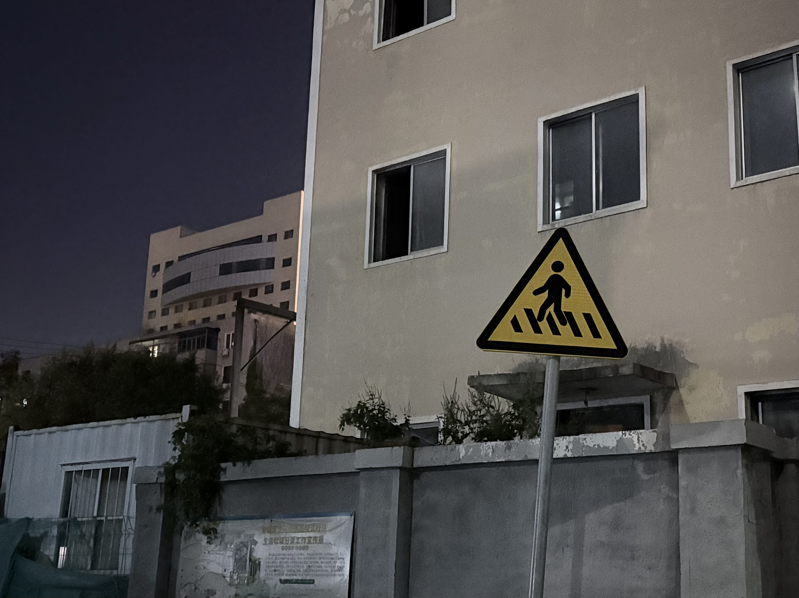

# 您好呀 我是棉花糖

## Hello World!

Welcome to the Github account of Arikawayuumi/MisnCandy!     
Hope the words here can bring you some happiness, thinking, courage, touching and strength.    

💬 zh/en is ok!  

- 🍭 You can call me "棉花糖" or "北橋川" in Chinese. 
- 🏫 Ordinary China Mainland college students
- ⚖️ law student  
- 📚 Happy to provide legal advice/services on civil and administrative law  
- 👩‍💻 Social science enthusiast  
- 🏳️‍⚧️ Transgender,she/her  
- 🏳️‍🌈 Trans lesbian  
- 🎮 Maimai DX/osu/Civilization VII  
- 📝 Literature/social observation/social science article writing    
- 😷 A person with a bipolar disorder and mild schizophrenia    
- 💊 Currently taking zolpidem/alprazolam/clonazepam    
- 📫 On the left is my contact information    

😘 Wish you can be free and happiness.  

There is no need to ask what universal values ​​are, universal values ​​are in our hearts.  

> “死亡是一种权力，这样的权力可以保持最后的自我。”  
> "Death is a power, such power can maintain the last self."    

If they could make me stop loving you–—that would be real betrayal.    

I stand with freedom,with peace and love,and more important,with you.   

> One day the clouds will all dissipate,  
> We shall meet in the place where there is no darkness,   
> And express our opinions in the sunshine of freedom.    

> 等到一切结束之后 风会停的 

<!--
**KitahasiKawa/KitahasiKawa** is a ✨ _special_ ✨ repository because its `README.md` (this file) appears on your GitHub profile.

Here are some ideas to get you started:

- 🔭 I’m currently working on ...
- 🌱 I’m currently learning ...
- 👯 I’m looking to collaborate on ...
- 🤔 I’m looking for help with ...
- 💬 Ask me about ...
- 📫 How to reach me: ...
- 😄 Pronouns: ...
- ⚡ Fun fact: ...
-->
